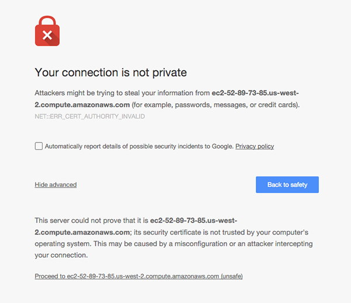
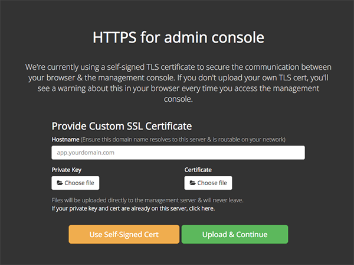
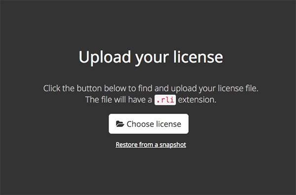
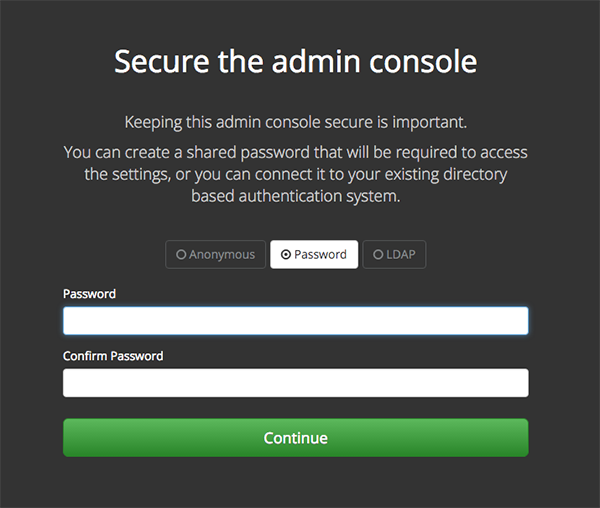
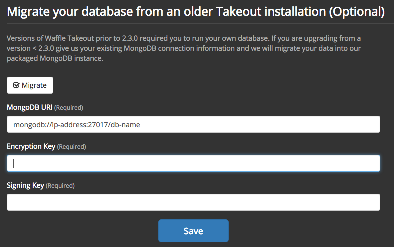
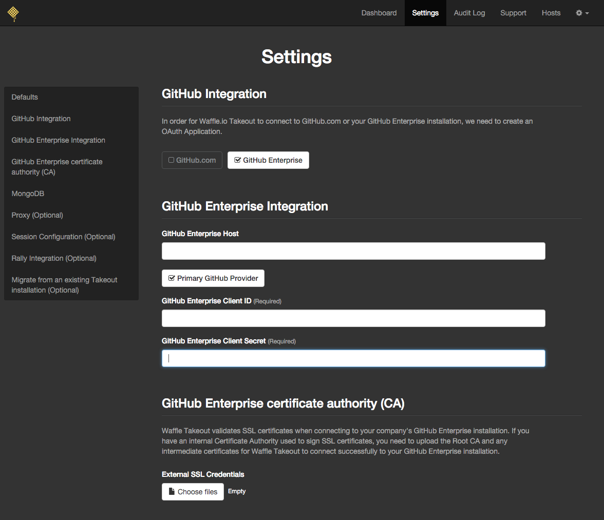
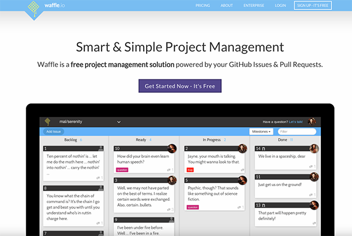
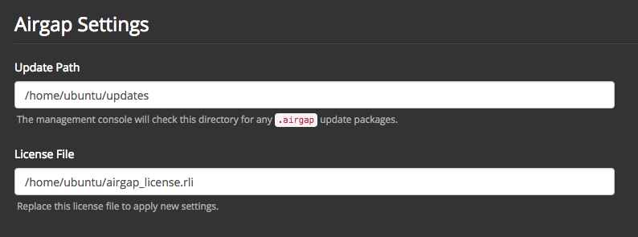

# Installing Waffle Takeout

Go to [https://takeout.waffle.io](https://takeout.waffle.io) for more information on pricing and to sign up for a free 45 day trial.

Getting Started guides and other Waffle.io documentation can be found [here](https://github.com/waffleio/waffle.io/wiki).

# Prerequisites

* A supported Linux server (modern versions of Ubuntu, Debian, CentOS, Red Hat & Fedora)
* A Waffle Takeout license file (downloadable from [https://takeout.waffle.io](https://takeout.waffle.io))
* A GitHub Enterprise installation secured via SSL certificate. (Waffle Takeout does not support connecting to GitHub Enterprise insecurely over HTTP at this time.)

## Host Machine

The standard setup consists of one host.

If you are using EC2, we recommend the m4.large instance type with at least a 32GB EBS volume.

For other setups we recommend hosts with 8 gigs of RAM and 2 CPUs.

## Network Configuration

To run Waffle Takeout, you will need to ensure the following ports are open:

| Port          | Service       | Description                                                                      |
| :------------ |:--------------| :--------------------------------------------------------------------------------|
| 8800          | Custom TCP    | This port is to access the admin dashboard for your Waffle Takeout installation  |
| 9880          | Custom TCP    | This port is for replicated host api to update the admin dashboard's status      |
| 443           | HTTPS         | Web application over HTTPS access                                                |
| 80            | HTTP          | Web application access                                                           |
| 22            | SSH           | SSH access                                                                       |

## Register a GitHub.com OAuth app

Waffle Takeout talks to GitHub Enterprise and GitHub.com via OAuth. You will need to create an OAuth application on your GitHub Enterprise installation or GitHub.com that Waffle Takeout can connect to.

#### For GitHub Enterprise

To register an OAuth application, first click on your profile icon. From there, navigate to Settings->Applications and to the Developer Applications tab. Select 'Register New Application.'

Make sure the Homepage URL and Authorization Callback match the URL for your Waffle Takeout installation: `https://waffle.company.com` (just the base url for where it's installed, no special path required).

When configuring your GitHub Enterprise url on the admin settings page, make sure to include the protocol ("https://") in the url.

## Installation

#### 1. SSH into your Linux server
#### 2. Run the following script:

 ```curl
$ curl -sSL https://takeout.waffle.io/get | sudo bash
 ```

#### 3. Access your server via HTTPS on port 8800 & bypass the SSL security warning.



#### 4. Upload a custom TLS/SSL cert/key or proceed with the provided self-signed pair.



#### 5. Upload the provided license file (.rli)




#### <a name="step6">6</a>. Secure your Waffle Takeout Management console with a password



#### 7. Migrating your old database
Unless you are migrating from Waffle Takeout 1.x and the bash installation script, skip to [step 8](https://github.com/waffleio/waffle.io-takeout/blob/master/INSTALL.md#8-configure-your-waffle-takeout-instance-and-click-save).

Upgrading from Takeout 1.x to Takeout 2.x requires configuring the new installation with your existing database information. Check the optional "Migrate" checkbox. Provide the "MongoDB URI", "Encryption Key", and "Signing Key" from your existing installation. These are found in your `/etc/waffle/environment.list` file on your host machine.



#### 8. Configure your Waffle Takeout instance and click "Save"



#### 9. Visit the hostname you provided to access Waffle Takeout



### Airgap Installation

**If you need an airgap installation, please contact us at <takeout@waffle.io> so we can provide you with a download link and instructions for getting a Takeout package.**

For installations who don't have easy access to the internet, you can install Waffle Takeout using the following steps. These installations are "airgapped" meaning that they "do not have inbound or outbound internet traffic at all". Waffle Takeout supports this using Replicated's airgap feature.

> __Note__: You will need to provision a host machine as noted above, but with at least 64G of space for this install as opposed to the 32G mentioned.

#### 1. Follow the [Replicated Airgap install docs](http://docs.replicated.com/docs/airgapped-installations#2-install-replicated). You will need to up the default base device size for Docker to 20G. You can do so by adding the following to `/etc/docker/default`.

```bash
DOCKER_OPTS="--storage-opt dm.basesize=20G"
```

Once that change is made, restart the docker daemon (Ubuntu/Debian):

```bash
sudo service docker stop
sudo rm -rf /var/lib/docker
sudo service docker start
```

#### 2. The Airgap package is what is downloaded from the Airgap link we provide you. You can `shift-click` in your browser to download the file or you can use something like `wget`.

```bash
wget --trust-server-names -O <your_file_name>.airgap "<link_we_provide>"
```

#### 3. Once you have the host machine up and running and have installed docker and replicated, upload the `.airgap` package onto the host machine and remember the path to the file. One way is to use `scp` on your computer to upload the file to the host machine.


```bash
scp -i ~/.ssh/your_key.pem /path/to/your_airgap_file.airgap ubuntu@<host_machine_url>:/path/to/upload/to
```

> Note: You may need to run the following commands on the host machine to restart the Management Screen UI (Ubuntu/Debian)

```
sudo service replicated restart
sudo service replicated-ui restart
sudo service replicated-operator restart
```

#### 4. Continue following the [Replicated Airgap install docs](http://docs.replicated.com/docs/airgapped-installations) to locate the package on the host machine and upload your license in the management ui.

#### 5. Follow the above steps for installing Waffle Takeout starting from [Step 6](#step6)

## Maintenance

### Backups

Waffle Takeout automatically takes snapshots of the application state and database every 24 hours. These snapshots can be used to restore your Takeout installation in the event that something happens to the host machine or the installation itself. Snapshots are stored in `/var/lib/replicated/snapshots` on the host machine. It is highly recommended that you copy these backups to another location each day so that you are not at risk of losing them along with your installation in the event the host machine encounters complications.

### Updating your Waffle Takeout Installation

Update the Replicated agent on the host machine before upgrading the Waffle Takeout application. This is not always required, and the UI will prompt you to do so if it is required:

```curl
$ sudo apt-get update
$ sudo apt-get install replicated replicated-ui replicated-agent replicated-updater
```

You can check for new app releases by going to the management interface dashboard `https://waffle.company.com:8800` and clicking on the 'Check Now' button. If an update is available you will be able to read the release notes and install the update.

#### Updating an Airgap installation

To update an Airgap installation, you will need to download a new package via a link that we provide you and upload it to the server location specified in the "Console Settings" in the management ui.



To download the package onto your computer, you can use something similar to `wget`:

```bash
wget --trust-server-names -O <your_update>.airgap "<link_we_provide>"
```

Then to upload the package onto the host machine, you can use something similar to `scp`:

```bash
scp -i ~/.ssh/your_key.pem /path/to/updated_package.airgap ubuntu@<host_machine_url>:/path/to/updates
```

On the dashboard in the management ui, you can now click "Check Now" and should see the new update to install.

## Migrating from 1.x (self-install) to 2.x (Replicated install)

Starting with Waffle Takeout 2.x, installation changed to use [Replicated](https://replicated.com) instead of the custom installation bash script. If you installed Waffle Takeout by downloading a zip file and manually running an installation script, you'll need to migrate to the Replicated installation method. You can do that by following the [installation instructions](https://github.com/waffleio/waffle.io-takeout/blob/master/INSTALL.md#installation) above.

__NOTE: Upgrading from Waffle Takeout 1.x to Waffle Takeout 2.x requires an additional configuration step before starting Takeout. This is documented in [step 7](https://github.com/waffleio/waffle.io-takeout/blob/master/INSTALL.md#7-migrating-your-old-database) above.__
